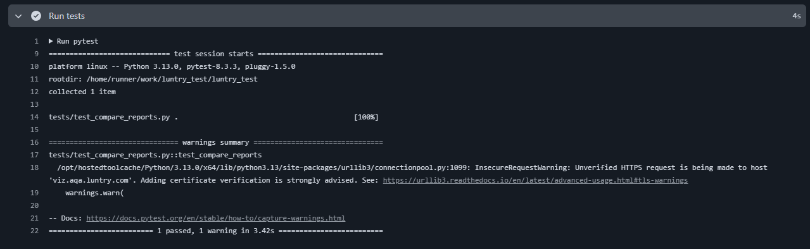
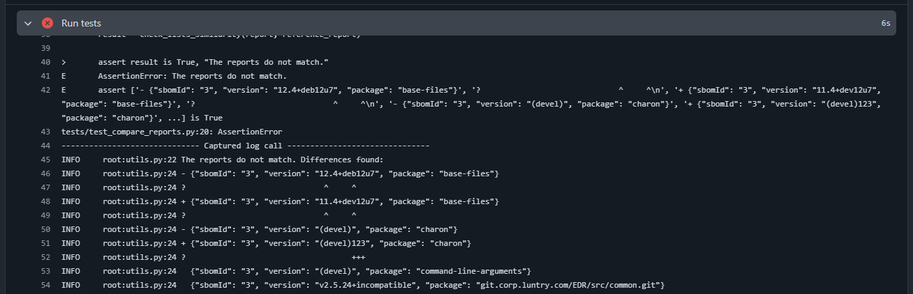

# Luntry autotests project

Тестовое задание по автоматизации сверки SBOM репорта с эталоном

## Локальный запуск

```bash
# Клонировать репозиторий
git clone https://github.com/testacc2253/luntry_test.git

# Перейти в папку с проектом
cd luntry_test

# Установить зависимости
pip install -r requirements.txt

# Скорпировать файл .env.example и переименовать его в .env.test
cp .env.example .env.test

# Заполнить переменные BASE_URL и API_TOKEN в .env.test

# Запустить pytest
pytest
```

## Запуск в пайплайне

1. Открыть проект в Github https://github.com/testacc2253/luntry_test
2. Перейти в Actions
3. Выбрать workflow Run Tests
4. Нажать Run workflow, выбрав нужную ветку

## Примеры вывода результатов

1. Успешно пройденный тест


2. Неуспешно пройденный тест (использован заведомо некорректный отчет, можно посмотреть на ветке failed_test)
